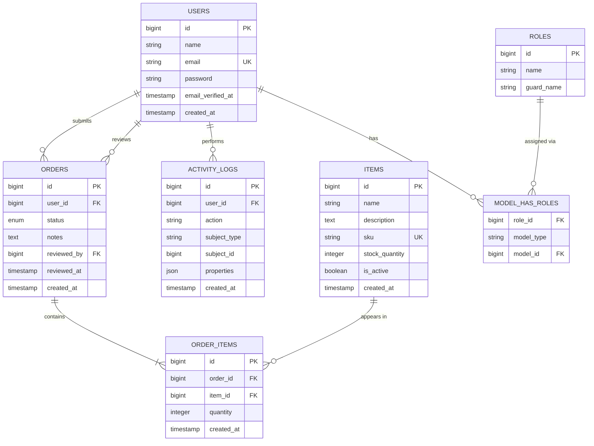

# Asset Management System  — Entity Relationship Diagram (ERD)

## Relationships

- **`users` → `orders` (submits), one-to-many.** Each order has exactly one `user_id` pointing to the customer who created it. A user can have many orders. This is the core "request history" relationship that powers the customer dashboard.

- **`users` → `orders` (reviews), one-to-many, self-referencing through the same table.** `reviewed_by` is a second, nullable foreign key on `orders` back to `users`. It's nullable because a freshly submitted order has no reviewer yet. This gets populated only once an admin acts on it. Both `user_id` and `reviewed_by` point at the same `users` table, but represent two distinct relationships (requester vs. reviewer), so in Eloquent these are two separate `belongsTo` definitions on the `Order` model with explicit foreign key names, not a single relation.

- **`orders` ↔ `items` via `order_items`, many-to-many.** An order can contain multiple items, and an item can appear across many orders, so a pure FK on either side wouldn't work — `order_items` is the pivot/junction table that resolves this. The `quantity` column lives here rather than on `items` or `orders` because it's a property of *that specific item within that specific order*, not of the item or order in general.

- **`users` ↔ `roles` via `model_has_roles`, many-to-many polymorphic.** This is Spatie's `laravel-permission` schema scaffolded by the `create_permission_tables` migration. `model_has_roles` uses `model_type` + `model_id` rather than a fixed `user_id`, which is what lets Spatie attach roles to any model, not just `User`.

## Implications of the schema

- **No `role` column on `users`.** Role-checking happens through Spatie's pivot tables (`$user->hasRole('admin')`), not a column comparison. This means seeding the first admin is a two-step act — create the user row, then `$user->assignRole('admin')`  rather than a single insert with `role = 'admin'`.

- **Stock status is derived, not stored.** `items.stock_quantity` is the single source of truth; "In Stock" / "Out of Stock" badges in the UI are computed (`stock_quantity > 0`) rather than written to a separate column. 

- **Inventory deduction is a side effect of an `orders.status` transition, not a separate table.** When an admin moves an order from `pending` to `approved`/`fulfilled`, the system loops over that order's `order_items` and decrements the matching `items.stock_quantity`. This logic belongs in the application layer (an Eloquent observer, a service class, or inline in the Livewire component handling the status update), this isn't something the schema enforces on its own. 

- **`order_items.quantity` has no built-in guard against exceeding `items.stock_quantity`.** The schema permits a customer to request more than what's in stock. That validation is intentionally left to the application layer at submission time, since "is this in stock" can change between when the customer loads the catalog and when they hit submit.

- **`orders.status` as a single enum, not a separate status-history table.** This is a lean tradeoff: the aschema only logs the *current* state, not a full audit trail of every transition. 

- **`sku` (Stock Keeping Unit) and `description` are nullable on `items`.** This keeps the catalog easy to seed without forcing a fully fleshed-out product.

- **`activity_logs.properties` is a JSON column, not fixed fields.** Different actions carry different metadata (an item update might log old vs. new `stock_quantity`; an order approval might log nothing extra). A flexible JSON blob avoids needing a wide, mostly-null table or a separate schema per action type, at the cost of not being queryable/indexable the way a fixed column would be. 